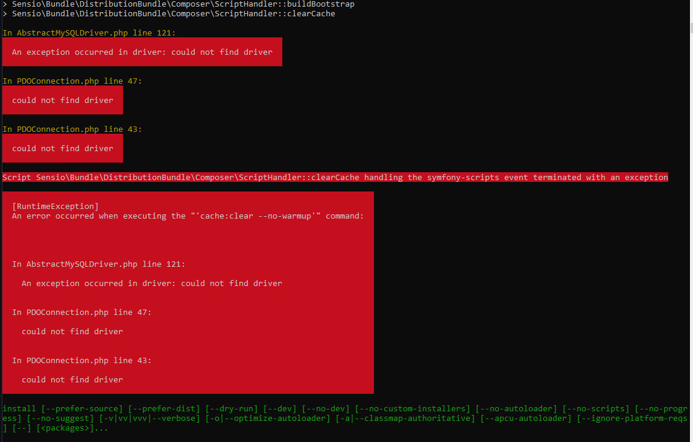
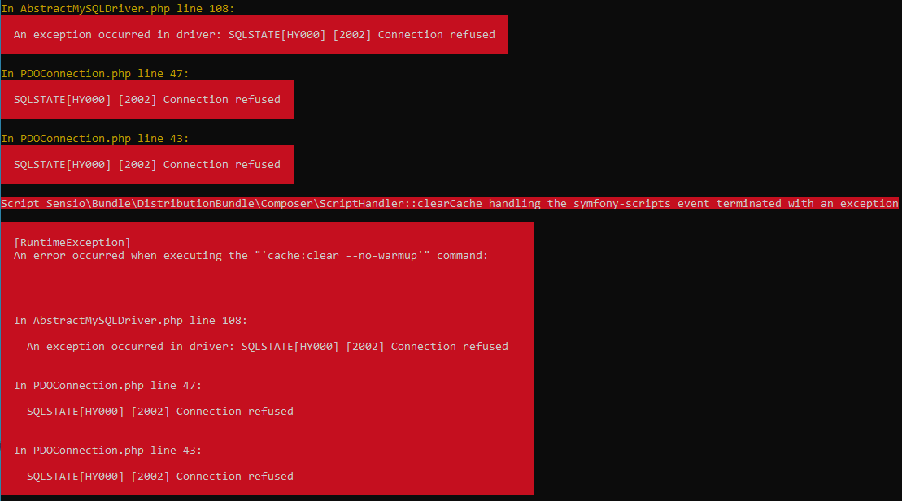
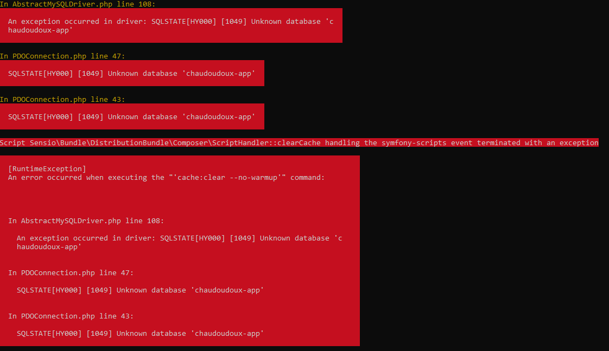
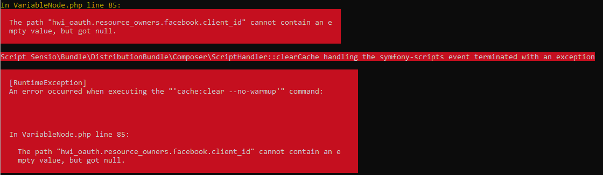

# cocorico-faq

After installing 

- composer https://www.digitalocean.com/community/tutorials/how-to-install-and-use-composer-on-ubuntu-20-04-fr
- mongodb-org https://www.digitalocean.com/community/tutorials/how-to-install-mongodb-on-ubuntu-20-04-fr

got this error

```
ubuntu@vps-xyz:/home/xyz/github/cocolabs-sas/cocorico/v0151/cocorico-0.15.1$ composer install
You are using Composer 1 which is deprecated. You should upgrade to Composer 2, see https://blog.packagist.com/deprecating-composer-1-support/
Loading composer repositories with package information
Installing dependencies (including require-dev) from lock file
Warning: The lock file is not up to date with the latest changes in composer.json. You may be getting outdated dependencies. It is recommended that you run `composer update` or `composer update <package name>`.
Your requirements could not be resolved to an installable set of packages.

  Problem 1
    - Installation request for alcaeus/mongo-php-adapter 1.1.3 -> satisfiable by alcaeus/mongo-php-adapter[1.1.3].
    - alcaeus/mongo-php-adapter 1.1.3 requires ext-mongodb ^1.2.0 -> the requested PHP extension mongodb is missing from your system.
  Problem 2
    - Installation request for cocur/slugify v3.0.1 -> satisfiable by cocur/slugify[v3.0.1].
    - cocur/slugify v3.0.1 requires ext-mbstring * -> the requested PHP extension mbstring is missing from your system.
  Problem 3
    - Installation request for friendsofsymfony/ckeditor-bundle 2.1.0 -> satisfiable by friendsofsymfony/ckeditor-bundle[2.1.0].
    - friendsofsymfony/ckeditor-bundle 2.1.0 requires ext-zip * -> the requested PHP extension zip is missing from your system.
  Problem 4
    - Installation request for mongodb/mongodb 1.2.0 -> satisfiable by mongodb/mongodb[1.2.0].
    - mongodb/mongodb 1.2.0 requires ext-mongodb ^1.3.0 -> the requested PHP extension mongodb is missing from your system.
  Problem 5
    - Installation request for symfony/symfony v3.4.36 -> satisfiable by symfony/symfony[v3.4.36].
    - symfony/symfony v3.4.36 requires ext-xml * -> the requested PHP extension xml is missing from your system.
  Problem 6
    - Installation request for behat/behat v3.4.3 -> satisfiable by behat/behat[v3.4.3].
    - behat/behat v3.4.3 requires ext-mbstring * -> the requested PHP extension mbstring is missing from your system.
  Problem 7
    - Installation request for phar-io/manifest 1.0.1 -> satisfiable by phar-io/manifest[1.0.1].
    - phar-io/manifest 1.0.1 requires ext-dom * -> the requested PHP extension dom is missing from your system.
  Problem 8
    - Installation request for phpunit/php-code-coverage 5.3.0 -> satisfiable by phpunit/php-code-coverage[5.3.0].
    - phpunit/php-code-coverage 5.3.0 requires ext-dom * -> the requested PHP extension dom is missing from your system.
  Problem 9
    - Installation request for phpunit/phpunit 6.5.4 -> satisfiable by phpunit/phpunit[6.5.4].
    - phpunit/phpunit 6.5.4 requires ext-dom * -> the requested PHP extension dom is missing from your system.
  Problem 10
    - Installation request for theseer/tokenizer 1.1.0 -> satisfiable by theseer/tokenizer[1.1.0].
    - theseer/tokenizer 1.1.0 requires ext-dom * -> the requested PHP extension dom is missing from your system.
  Problem 11
    - symfony/symfony v3.4.36 requires ext-xml * -> the requested PHP extension xml is missing from your system.
    - sensio/generator-bundle v3.1.7 requires symfony/console ~2.7|~3.0 -> satisfiable by symfony/symfony[v3.4.36].
    - Installation request for sensio/generator-bundle v3.1.7 -> satisfiable by sensio/generator-bundle[v3.1.7].

  To enable extensions, verify that they are enabled in your .ini files:
    - /etc/php/7.4/cli/php.ini
    - /etc/php/7.4/cli/conf.d/10-opcache.ini
    - /etc/php/7.4/cli/conf.d/10-pdo.ini
    - /etc/php/7.4/cli/conf.d/20-calendar.ini
    - /etc/php/7.4/cli/conf.d/20-ctype.ini
    - /etc/php/7.4/cli/conf.d/20-curl.ini
    - /etc/php/7.4/cli/conf.d/20-exif.ini
    - /etc/php/7.4/cli/conf.d/20-ffi.ini
    - /etc/php/7.4/cli/conf.d/20-fileinfo.ini
    - /etc/php/7.4/cli/conf.d/20-ftp.ini
    - /etc/php/7.4/cli/conf.d/20-gettext.ini
    - /etc/php/7.4/cli/conf.d/20-iconv.ini
    - /etc/php/7.4/cli/conf.d/20-json.ini
    - /etc/php/7.4/cli/conf.d/20-phar.ini
    - /etc/php/7.4/cli/conf.d/20-posix.ini
    - /etc/php/7.4/cli/conf.d/20-readline.ini
    - /etc/php/7.4/cli/conf.d/20-shmop.ini
    - /etc/php/7.4/cli/conf.d/20-sockets.ini
    - /etc/php/7.4/cli/conf.d/20-sysvmsg.ini
    - /etc/php/7.4/cli/conf.d/20-sysvsem.ini
    - /etc/php/7.4/cli/conf.d/20-sysvshm.ini
    - /etc/php/7.4/cli/conf.d/20-tokenizer.ini
  You can also run `php --ini` inside terminal to see which files are used by PHP in CLI mode.
```

I just had to do

`sudo apt-get install php-mongodb`

Now the first problem has gone

```
  Problem 1
    - cocur/slugify is locked to version v3.0.1 and an update of this package was not requested.
    - cocur/slugify v3.0.1 requires ext-mbstring * -> it is missing from your system. Install or enable PHP's mbstring extension.
  Problem 2
    - friendsofsymfony/ckeditor-bundle is locked to version 2.1.0 and an update of this package was not requested.
    - friendsofsymfony/ckeditor-bundle 2.1.0 requires ext-zip * -> it is missing from your system. Install or enable PHP's zip extension.
  Problem 3
    - ocramius/package-versions is locked to version 1.2.0 and an update of this package was not requested.
    - ocramius/package-versions 1.2.0 requires composer-plugin-api ^1.0 -> found composer-plugin-api[2.2.0] but it does not match the constraint.
  Problem 4
    - robloach/component-installer is locked to version 0.2.3 and an update of this package was not requested.
    - robloach/component-installer 0.2.3 requires composer-plugin-api ^1.0 -> found composer-plugin-api[2.2.0] but it does not match the constraint.
  Problem 5
    - symfony/symfony is locked to version v3.4.36 and an update of this package was not requested.
    - symfony/symfony v3.4.36 requires ext-xml * -> it is missing from your system. Install or enable PHP's xml extension.
  Problem 6
    - behat/behat is locked to version v3.4.3 and an update of this package was not requested.
    - behat/behat v3.4.3 requires ext-mbstring * -> it is missing from your system. Install or enable PHP's mbstring extension.
  Problem 7
    - phar-io/manifest is locked to version 1.0.1 and an update of this package was not requested.
    - phar-io/manifest 1.0.1 requires ext-dom * -> it is missing from your system. Install or enable PHP's dom extension.
  Problem 8
    - phpunit/php-code-coverage is locked to version 5.3.0 and an update of this package was not requested.
    - phpunit/php-code-coverage 5.3.0 requires ext-dom * -> it is missing from your system. Install or enable PHP's dom extension.
  Problem 9
    - phpunit/phpunit is locked to version 6.5.4 and an update of this package was not requested.
    - phpunit/phpunit 6.5.4 requires ext-dom * -> it is missing from your system. Install or enable PHP's dom extension.  Problem 10
    - theseer/tokenizer is locked to version 1.1.0 and an update of this package was not requested.
    - theseer/tokenizer 1.1.0 requires ext-dom * -> it is missing from your system. Install or enable PHP's dom extension.
  Problem 11
    - wikimedia/composer-merge-plugin is locked to version v1.4.1 and an update of this package was not requested.
    - wikimedia/composer-merge-plugin v1.4.1 requires composer-plugin-api ^1.0 -> found composer-plugin-api[2.2.0] but it does not match the constraint.
  Problem 12
    - symfony/symfony v3.4.36 requires ext-xml * -> it is missing from your system. Install or enable PHP's xml extension.
    - sensio/generator-bundle v3.1.7 requires symfony/console ~2.7|~3.0 -> satisfiable by symfony/symfony[v3.4.36].
    - sensio/generator-bundle is locked to version v3.1.7 and an update of this package was not requested.
```

Other errors

If you have an error like `requires composer-plugin-api ^1.0` you need to downgrade by doing

`sudo composer self-update --1`

Problem 1 fixed by doing

`sudo apt-get install php-mongodb`

Problem 2 fixed by doing

`sudo apt-get install php-mbstring`

Problem 3 fixed by doing

`sudo apt-get install php-zip`

Problem 5 fixed by doing 

`sudo apt-get install php-xml`

Installation process starts

```
ubuntu@vps-xyz:/home/xyz/github/cocolabs-sas/cocorico/v0151/cocorico-0.15.1$ sudo composer install
Do not run Composer as root/super user! See https://getcomposer.org/root for details
You are using Composer 1 which is deprecated. You should upgrade to Composer 2, see https://blog.packagist.com/deprecating-composer-1-support/
Loading composer repositories with package information
Installing dependencies (including require-dev) from lock file
Warning: The lock file is not up to date with the latest changes in composer.json. You may be getting outdated dependencies. It is recommended that you run `composer update` or `composer update <package name>`.
Package operations: 168 installs, 0 updates, 0 removals
  - Installing ocramius/package-versions (1.2.0): Downloading (100%)
  - Installing wikimedia/composer-merge-plugin (v1.4.1): Downloading (100%)
  - Installing symfony/polyfill-mbstring (v1.6.0): Downloading (100%)
  - Installing symfony/polyfill-ctype (v1.11.0): Downloading (100%)
  - Installing twig/twig (v2.12.3): Downloading (100%)
  - Installing paragonie/random_compat (v2.0.11): Downloading (100%)
  - Installing symfony/polyfill-php70 (v1.6.0): Downloading (100%)
  - Installing symfony/polyfill-util (v1.6.0): Downloading (100%)
  - Installing symfony/polyfill-php56 (v1.6.0): Downloading (100%)
  - Installing symfony/symfony (v3.4.36): Downloading (100%)
  - Installing kriswallsmith/assetic (v1.4.0): Downloading (100%)
  - Installing robloach/component-installer (0.2.3): Downloading (100%)
  - Installing symfony/polyfill-intl-icu (v1.6.0): Downloading (100%)
  - Installing symfony/polyfill-apcu (v1.6.0): Downloading (100%)
  - Installing psr/simple-cache (1.0.0): Downloading (100%)
  - Installing psr/log (1.0.2): Downloading (100%)
```

Aftyer everything is installed 

```
database_host (127.0.0.1):
database_port (null):
database_name (cocorico_dev):
database_user (cocorico_dev):
database_password (cocorico_dev): ProvideAPassWord
mongodb_server ('mongodb://localhost:27017'):
mongodb_database_name (cocorico_dev):
mailer_transport (smtp):
mailer_host (127.0.0.1):
mailer_user (null):
mailer_password (null):
mailer_port (null):
secret (ThisTokenIsNotSoSecretChangeIt):NEWTOKEN
use_assetic_controller (false):
cocorico.assets_base_urls ('https://cocorico.dev'): https://my.chaudoudoux.app
router.request_context.host (cocorico.dev): chaudoudoux.app
router.request_context.scheme (https):
router.request_context.base_url (''):
cocorico.admin (admin):
cocorico.admin_translation (false):
cocorico.check_translation (false):
cocorico.translator.secret.key (null):
cocorico.facebook.app_id (null):
cocorico.facebook.secret (null):
cocorico.image_driver (imagick):
cocorico.google_analytics (UA-64445856-1):
cocorico.google_tag_manager (false):
cocorico_geo.google_place_api_key (null):
cocorico_geo.google_place_server_api_key (null):
cocorico_geo.ipinfodb_api_key (null):
cocorico.deploy.host (fake.cocorico.prod): my.chaudoudoux.app
cocorico.deploy.dir (/fake/path): /home/xyz/github/cocolabs-sas/cocorico/v0151/cocorico-0.15.1
cocorico.deploy.user (fakeuser):
cocorico.booking.expiration_delay (2880):
cocorico.booking.acceptation_delay (240):
cocorico.booking.alert_expiration_delay (120):
cocorico.booking.alert_imminent_delay (1440):
cocorico.booking.validated_moment (start):
cocorico.booking.validated_delay (0):
cocorico.bankwire_checking_simulation (false):
```
Then I get this error



do `sudo apt install php-mysql`

then you'll have this error that is due to the user and password of the MySQL database



After you understand some stuff



```
database_host (127.0.0.1):
database_port (null): 3306
database_name (cocorico_dev): chaudoudoux-app
database_user (cocorico_dev): youruser
database_password (cocorico_dev): yourpassword
mongodb_server ('mongodb://localhost:27017'):
mongodb_database_name (cocorico_dev): chaudoudoux-app-mongo
mailer_transport (smtp):
mailer_host (127.0.0.1):
mailer_user (null):
mailer_password (null):
mailer_port (null):
secret (ThisTokenIsNotSoSecretChangeIt):changeit
use_assetic_controller (false):
cocorico.assets_base_urls ('https://cocorico.dev'): https://my.chaudoudoux.app
router.request_context.host (cocorico.dev): my.chaudoudoux.app
router.request_context.scheme (https):
router.request_context.base_url (''):
cocorico.admin (admin):
cocorico.admin_translation (false):
cocorico.check_translation (false):
cocorico.translator.secret.key (null):
cocorico.facebook.app_id (null):
cocorico.facebook.secret (null):
cocorico.image_driver (imagick):
cocorico.google_analytics (UA-64445856-1):
cocorico.google_tag_manager (false):
cocorico_geo.google_place_api_key (null):
cocorico_geo.google_place_server_api_key (null):
cocorico_geo.ipinfodb_api_key (null):
cocorico.deploy.host (fake.cocorico.prod): my.chaudoudoux.app
cocorico.deploy.dir (/fake/path): /home/xyz/github/cocolabs-sas/cocorico/v0151/cocorico-0.15.1
cocorico.deploy.user (fakeuser):
cocorico.booking.expiration_delay (2880):
cocorico.booking.acceptation_delay (240):
cocorico.booking.alert_expiration_delay (120):
cocorico.booking.alert_imminent_delay (1440):
cocorico.booking.validated_moment (start):
cocorico.booking.validated_delay (0):
cocorico.bankwire_checking_simulation (false):
```


